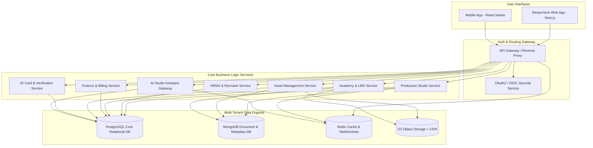

# Chitraspanda Studios: Enterprise Portal Architecture

Welcome to the comprehensive system design and architecture specifications for **Chitraspanda Studios**—an all-in-one, multi-tenant, cloud-based platform designed to run enterprise animation production, client collaboration, HR, recruitment, academy/LMS, finance, and asset management in a single integrated ecosystem.

---

## Architecture Overview

Chitraspanda Studios is designed as a modular, multi-tenant SaaS (Software as a Service) platform. It provides a secure, high-performance environment supporting multiple organizations (studios), projects, departments, and thousands of concurrent users (animators, clients, HR, recruiters, students, interns, and administrators).

---

## Architectural Documentation Directory Map

This specification is broken down into modular files. Click any file link below to read the detailed design:

1. **[01_user_portal_matrix.md](file:///c:/Users/tarzo/Desktop/chitra%20god/docs/01_user_portal_matrix.md)**
   - Complete User Portal Matrix (23 Portals)
   - Comprehensive User Journeys (Onboarding, Daily Actions, Exit) for each user type
   - Fine-grained Role-Based Access Control (RBAC) Permission Matrix
2. **[02_dashboard_layouts.md](file:///c:/Users/tarzo/Desktop/chitra%20god/docs/02_dashboard_layouts.md)**
   - Grid layouts and Key Performance Indicators (KPIs) for each of the 23 dashboards
   - System Navigation Trees and sidebars
3. **[03_database_design.md](file:///c:/Users/tarzo/Desktop/chitra%20god/docs/03_database_design.md)**
   - Multi-tenant relational schema (PostgreSQL) and NoSQL schemas (MongoDB)
   - Table details, keys, indexes, and Row-Level Security (RLS) policies
4. **[04_api_design.md](file:///c:/Users/tarzo/Desktop/chitra%20god/docs/04_api_design.md)**
   - API endpoints, GraphQL schemas, and detailed request/response JSON payloads
5. **[05_security_architecture.md](file:///c:/Users/tarzo/Desktop/chitra%20god/docs/05_security_architecture.md)**
   - Identity Management, OAuth2/OIDC, Multi-factor Authentication (MFA)
   - Logging, auditing, and activity tracking mechanisms
6. **[06_ui_ux_wireframes.md](file:///c:/Users/tarzo/Desktop/chitra%20god/docs/06_ui_ux_wireframes.md)**
   - Dashboard wireframe designs and interface interactions
   - Design system tokens (colors, fonts, animation rules)
7. **[07_mobile_app_structure.md](file:///c:/Users/tarzo/Desktop/chitra%20god/docs/07_mobile_app_structure.md)**
   - Mobile app layouts, push notification patterns, and offline sync mechanisms
8. **[08_notification_and_ai.md](file:///c:/Users/tarzo/Desktop/chitra%20god/docs/08_notification_and_ai.md)**
   - In-app, push, email, and webhook notification system design
   - Role-specific AI capabilities and 3 detailed Cross-Portal workflows
9. **[09_priority_implementation.md](file:///c:/Users/tarzo/Desktop/chitra%20god/docs/09_priority_implementation.md)**
   - Phased delivery roadmap, development priority order, and deployment suggestions

---

## Common System Modules

The core system consists of 11 cross-cutting shared modules integrated throughout the portals:

*   **Authentication & Security**: Multi-factor authorization with single-sign-on (SSO) and JWT management.
*   **RBAC Permissions**: Row-level and column-level permission checks per organization.
*   **Notifications**: Centralized event-driven notification queue (Email, SMS, Push, Slack, Teams).
*   **Messaging**: In-app peer-to-peer and group chat with real-time WebSocket communication.
*   **Search**: Global Elasticsearch cluster for files, tasks, user profiles, courses, and assets.
*   **File Management (DAM)**: Robust version control, cloud uploads, and media proxy services.
*   **Audit Logs**: Immutable system logs containing `actor`, `action`, `resource`, `timestamp`, and `ip_address`.
*   **Activity Tracking**: Time-tracking and workspace behavior monitoring for productivity reporting.
*   **Calendar**: Shared system calendars supporting meetings, deadlines, production dates, and classes.
*   **AI Assistant**: Context-aware companion using domain-specific LLM prompts for creative and administrative aid.
*   **Reporting**: Complex BI reporting utilizing PostgreSQL read-replicas for on-demand performance charts.
